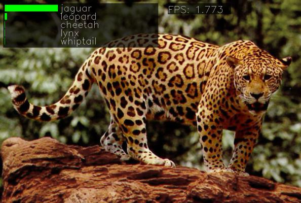
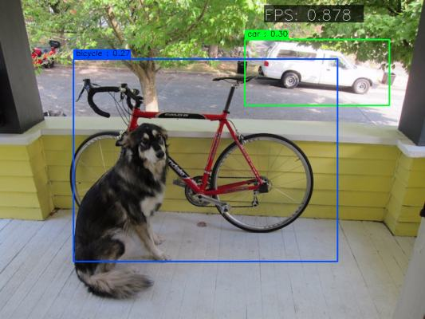

|Python27| |Python35| |License|

.. |Python27| image:: https://img.shields.io/badge/python-2.7-blue.svg
    :target: https://www.python.org/

.. |Python35| image:: https://img.shields.io/badge/python-3.5-blue.svg
    :target: https://www.python.org/

.. |License| image:: https://img.shields.io/badge/license-BSD2-blue.svg
    :target: https://github.com/Banus/caffe-demo/blob/master/LICENSE

Caffe demo
==========

This is a showcase of a small collection of neural networks implemented
in Caffe, in order to evaluate their speed and accuracy on videos and
images. A webcam interface is also available for live demos.

**Demo interface.** Image classification with SqueezeNet.
Jaguar image by *CaptainGiraffehands* on 
`Imgur <http://imgur.com/gallery/md8HT>`_.

Quick start
===========

Download all the models:

.. code:: bash

    cd models && ./download_models.sh all
    cd ..

Try the classification interface with *SqueezeNet* [1_]:

.. code:: bash

    python deep_classification.py images/jaguar.jpg squeezenet

Try classification on webcam with *GoogleNet*:

.. code:: bash

    python deep_classification.py webcam googlenet

Try the detection interface (CoCo classes) with the *Yolo-tiny* model:

.. code:: bash

    python deep_classification.py images/giraffe.jpg tiny_yolo

And the detection interface with Pascal VOC classes:

.. code:: bash

    python deep_classification.py images/dog.jpg tiny_yolo_voc

**Detection interface.** Object detection with YOLO-tiny.
Image from `Darknet <http://pjreddie.com/darknet/yolo/>`_ by Joseph Chet Redmon.

Installation
============

To run the demos, you need to compile the toolbox 
`Caffe <https://github.com/BVLC/caffe>`_ with Python support; follow the
instructions on the 
`BVLC website <http://caffe.berkeleyvision.org/installation.html>`_.
You both Python 2.7 and Python 3.5 distributions are supported.

You need also to install the Python interfaces for OpenCV; on Ubuntu:

.. code:: bash

    sudo apt-get install python-opencv

The script searches the current location of the Caffe toolbox in the
environmental variable ``CAFFE_ROOT``. Set it to your Caffe installation, e.g:

.. code:: bash

    export CAFFET_ROOT=${HOME}/caffe

You can download automatically all the networks supported by the demo
running the following script (beware: it will download around 500 MB):

.. code:: bash

    cd models && ./download_models.sh all

You can also download only the models you plan to use by passing them as
parameters, e.g.

.. code:: bash

    ./download_models.sh caffenet squeezenet

`YOLO <https://github.com/banus/caffe-yolo>`_ models cannot be
automatically downloaded from Google Drive and thus you have to download them
manually in the `models/yolo` path.
The links to the network weights in Caffe format are here:

+ `tiny_yolo <https://drive.google.com/open?id=0Bx7QZuu7oVBbNEt5YmUzRGNXZlk>`_ (CoCo classes)
+ `tiny_yolo_voc <https://drive.google.com/open?id=0Bx7QZuu7oVBbSEdpaDBGMVFIVk0>`_ (Pascal VOC classes)
+ `darknet <https://drive.google.com/open?id=0Bx7QZuu7oVBbU19ZdU5neFl0T1k>`__ (ImageNet 1k)
+ `tiny <https://drive.google.com/open?id=0Bx7QZuu7oVBbRUxyRk9NOFRueGM>`_ (ImageNet 1k)

Windows
-------

You can run the demos in Windows by installing one of the
`Caffe for Windows <https://github.com/BVLC/caffe/tree/windows>`_ pre-built
binaries.

To install the script dependences, such as *OpenCV*,
[Anaconda](https://conda.io/miniconda.html) is suggested.
If you use Python 3, Caffe currently supports only the version 3.5, so you may
have to create a virtual environment and activate it.
Type in the command console (**not** Powershell as it has issues with Anaconda
environments) if you are using Python 3:

.. code:: bash

	conda create -n caffe python=3.5
	activate caffe
	conda install scikit-image
    conda install -c conda-forge py-opencv protobuf

An Anaconda environment file is avalable in ``caffe-env.yml``.
Create the environent with:

..code:: bash

    conda create -n caffe -f caffe-env.yml

Set ``CAFFE_ROOT`` to point to the directory where you unpacked the Caffe
distribution.

To download the models, use the Git bash shell:

.. code:: bash

    cd models && sh download_models.sh all

The YOLO models will need to be downloaded manually.

Configuration file
------------------

The supported networks are specified in a ``network.ini`` configuration
file in the same directory of the script. Each section of the
configuration file specifies a supported network and you can add new sections or
modify the existing ones to support your Caffe networks.

Each section has the form:

.. code-block:: ini

    [network_name]
    type = class 
    model = path_to_caffe_prototxt
    weights = path_to_caffemodel
    labels = path_to_list_of_dataset_labels
    mean = mean_pixel
    anchors = list of floats

The parameter ``type`` specifies the kind of network to load; as for
now, the supported types are:

-  ``class``: classification network with a *n*-way softmax at the last layer
   named ``prob``
-  ``class_yolo``: classification network from *Darknet*, with different pixel
   scaling and center crop
-  ``yolo_detect``: YOLO detection network [2_] where the last layer
   specifies at once detected classes, regressed bounding boxes and box
   confidence

The parameters ``model`` and ``weights`` point to the *Caffe* files
required to load the network structure (``.prototxt``) and weights
(``.caffemodel``). All the paths are relative to the configuration file.

The ``labels`` parameter points to a file with the name of the
recognized classes in the order expected by the model. Currently are
available the classes for the *ImageNet*, *Places250*, *PascalVOC* and *MSCoCo*
datasets.

The optional ``mean`` parameter specifies the mean pixel value for the
dataset as a triple of byte values in BGR format. If the mean is not
available, the mean of the input image is used instead.

The optional ``anchors`` parameter specifies the bounding box biases in Darknet
v2 detection networks and it has to be manuall copied from the corresponding
``.cfg`` file.

**CPU mode**: an additional parameter ``device`` in the *DEFAULT*
section specifies if the CPU or the GPU (default) should be used for the
model. You can override the parameter for a specific network by
specifying a different device in its section.

References
==========

.. _1:

[1] Iandola, F. N., Moskewicz, M. W., Ashraf, *et al.* (2016). SqueezeNet: 
AlexNet-level accuracy with 50x fewer parameters and <1MB model size.
`Arxiv <http://arxiv.org/abs/1602.07360>`__. 

.. _2:

[2] Redmon, J., Divvala, S., Girshick, R., & Farhadi, A. (2015). 
You Only Look Once: Unified, Real-Time Object Detection. 
`Arxiv <http://arxiv.org/abs/1506.02640>`__.

License
=======

The code is released under the BDS 2-clause license, except for the
*yolo\_detector* module which under the 
`Darknet license <https://github.com/pjreddie/darknet/blob/master/LICENSE>`_ 
(free for non-commercial use).
